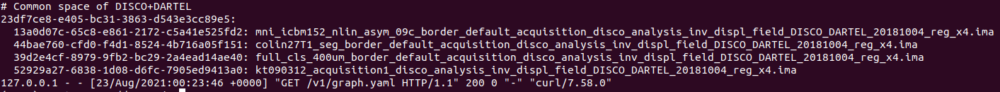
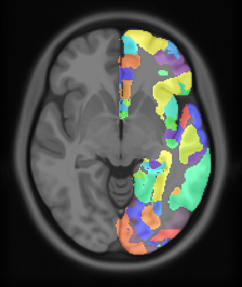
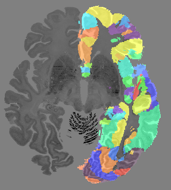
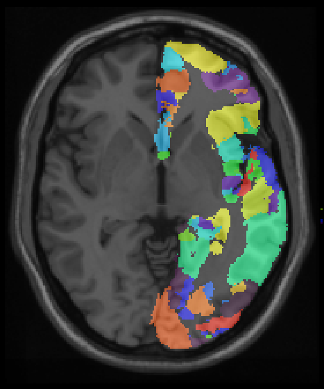
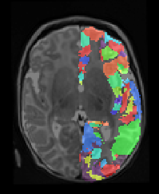

An HTTP backend for transforming coordinates (and, in the future, data) between the HBP core template spaces

.. image:: https://api.travis-ci.com/HumanBrainProject/hbp-spatial-backend.svg?branch=master
   :target: https://travis-ci.com/HumanBrainProject/hbp-spatial-backend
   :alt: Travis Build Status

.. image:: https://codecov.io/gh/HumanBrainProject/hbp-spatial-backend/branch/master/graph/badge.svg
   :target: https://codecov.io/gh/HumanBrainProject/hbp-spatial-backend
   :alt: Coverage Status

.. image:: https://img.shields.io/swagger/valid/3.0?label=OpenAPI&specUrl=https%3A%2F%2Fhbp-spatial-backend.apps.hbp.eu%2Fopenapi.json
   :target: https://hbp-spatial-backend.apps.hbp.eu/redoc
   :alt: Swagger Validator

Public deployments
==================

A production deployment (following the ``master`` branch) is deployed on https://hbp-spatial-backend.apps.hbp.eu. |uptime-prod|

The ``dev`` branch is deployed on https://hbp-spatial-backend.apps-dev.hbp.eu. |uptime-dev|

The public deployments are managed by OpenShift clusters, the relevant configuration is described in `<openshift-deployment/>`_.

Documentation
=============

The API is documented using the OpenAPI standard (a.k.a. Swagger): see `the ReDoc-generated documentation <https://hbp-spatial-backend.apps.hbp.eu/redoc>`_.

`A Swagger UI page <https://hbp-spatial-backend.apps.hbp.eu/swagger-ui>`_ is also available for trying out the API.

Step-by-step tutorial on docker example
=======================================

Pre-requisites
--------------

Docker needs to be installed.

If we don't want to use sudo for docker, we use the following commands:

.. code-block:: shell

   # Commands to use docker as non-sudo user
   sudo groupadd docker
   sudo usermod -aG docker $USER

At this stage, we can either login/logout or reboot the machine and check if docker is working:

.. code-block:: shell

   # To check that it works. It should output no error:
   docker ps

First steps
-----------

First, we build the docker image:

.. code-block:: shell

   # Command to run from the directory hbp-spatial-backend
   # This creates the container hbp-spatial-backend
   docker build -t hbp-spatial-backend .

Then, we mount data directory (where our nifti files lie)
into the directory /Data of the container and we run the docker container:

.. code-block:: shell

   # Runs the container and mounts your data directory
   # containing your nii files into the container directory /Data
   # Change DATA_DIR to match your local data directory
   DATA_DIR=/your/path/to/data/dir
   docker run -t -i --rm -p 8080:8080 -v $DATA_DIR:/Data hbp-spatial-backend

This has launched the flask server and has opened a bash shell in the container.

To check that it works, we now make a simple request from inside the container:

.. code-block:: shell

   # From inside the container
   curl -X GET "http://0.0.0.0:8080/v1/graph.yaml" -H  "accept: */*"

This reads the transformation graphs stored in the container.
The end of the output should be similar to this:

To check that AIMS tools have been installed properly,
we now launch from inside the container the AimsApplyTransform help command:

.. code-block:: shell

   AimsApplyTransform --help

We can also have access to the server from outside the container:

.. code-block:: shell

   # From outside the container, use the IP of your docker container
   # (to know it, run ifconfig)
   DOCKER_IP=172.17.0.1
   curl -X GET "http://$DOCKER_IP:8080/v1/graph.yaml" -H  "accept: */*"

Now, it is time to get our first transformation:

Getting our first local transformation
--------------------------------------

For this part, we will make use of the following dataset:
https://doi.org/10.25493/KJQN-AM0
This is the whole-brain parcellation of the Julich-Brain Cytoarchitectonic Atlas (v2.6).
The parcellation is done in the MNI ICBM 152 2009c nonlinear asymmetric reference space.
In this paragraph, we will transform this parcellation
done in the MNI ICBM 152 reference space into the Big Brain reference space.

On the web page https://doi.org/10.25493/KJQN-AM0,
we click on "download dataset" and on "download all related data as zip".

We now copy the nifti file that we will use
into the data directory (DATA_DIR used above):

.. code-block:: shell

   # From the host
   mkdir -p $DATA_DIR/tutorial_hbp_spatial_backend
   mv JulichBrain_MPMAtlas_l_N10_nlin2Stdicbm152asym2009c_publicDOI_3f5ec6016bc2242769c41befdbc1b2e0.nii.gz $DATA_DIR/tutorial_hbp_spatial_backend/julich-brain-l-native-mni152.nii.gz
   mv JulichBrain_MPMAtlas_l_N10_nlin2Stdicbm152asym2009c_publicDOI_3f5ec6016bc2242769c41befdbc1b2e0.xml $DATA_DIR/tutorial_hbp_spatial_backend/julich-brain-l-native-mni152.xml

Now, the nifti file julich-brain-l-native-mni152.nii.gz is accessible from the docker container at the location /Data/tutorial_hbp_spatial_backend.

We can visualize it (for example using Anatomist; note that the visualisation steps are not described here)
together with the MNI152 template:

There are utilities (get_local_image_transform_command.py)
to get the transform command from the server, format it and launch the AimsApplyTransform.
These utilities are contained in the container at the location /root/get_local_image_transform_command.py:

.. code-block:: shell

   # From the docker container
   cd /root
   ./get_local_image_transform_command.py --help

We now give to the program:
* the server address,
* the reference space of the input file ("MNI 152 ICBM 2009c Nonlinear Asymmetric"),
* the desired reference space of the output file ("Big Brain (Histology)"),
* the path of the input file (/Data/tutorial_hbp_spatial_backend/julich-brain-l-native-mni152.nii.gz),
* the path of the output file (here, /Data/tutorial_hbp_spatial_backend/julich-brain-l-in-bigbrain.nii.gz).

.. code-block:: shell

   # From the docker container
   ./get_local_image_transform_command.py -a http://0.0.0.0:8080 -s "MNI 152 ICBM 2009c Nonlinear Asymmetric" -t "Big Brain (Histology)" -i /Data/tutorial_hbp_spatial_backend/julich-brain-l-native-mni152.nii.gz -o /Data/tutorial_hbp_spatial_backend/julich-brain-l-in-bigbrain.nii.gz --interp nearest

After around one minute, the transformed file is created. The python script has made a request to the server to get the transform command and has launched AimsApplyTransform with the  correct transformations.

Note here that we have used an extra option (--interp nearest). It is an option that has been passed further to AimsApplyTransform.
It is only necessary because the file used is a file of labels (namely, the labels of the parcellation), thus the default linear interpolation is not correct. But, in the usual case, we will not add this option.

We now represent the left-brain parcellation together tith the big brain template (using Anatomist):

Getting transformations to other reference spaces
-------------------------------------------------

We can use now the same script to get the parcellation into the MNI Colin 27 reference space (-t "MNI Colin 27"):

We can also use it to get the parcellation into the infant reference space (-t "Infant Atlas"):

Development
===========

The backend needs to call ``AimsApplyTransform``, which is part of `the AIMS image processing toolkit <https://github.com/brainvisa/aims-free>`_. You can use `<docker-aims/script.sh>`_ to build a Docker image containing these tools (a pre-built image is available on Docker Hub: `ylep/brainvisa-aims <https://hub.docker.com/r/ylep/brainvisa-aims>`_).

Useful commands for development:

.. code-block:: shell

  git clone https://github.com/HumanBrainProject/hbp-spatial-backend.git

  # Install in a virtual environment
  cd hbp-spatial-backend
  python3 -m venv venv/
  . venv/bin/activate
  pip install -e .[dev]

  export FLASK_APP=hbp_spatial_backend
  flask run  # run a local development server

  # Tests
  pytest  # run tests
  pytest --cov=hbp_spatial_backend --cov-report=html  # detailed test coverage report
  tox  # run tests under all supported Python versions

  # Please install pre-commit if you intend to contribute
  pip install pre-commit
  pre-commit install  # install the pre-commit hook

  # Before a commit, you can launch the pre-commit:
  pre-commit run --all-files

Contributing
============

This repository uses `pre-commit`_ to ensure that all committed code follows minimal quality standards. Please install it and configure it to run as a pre-commit hook in your local repository (see above).

.. |uptime-prod| image:: https://img.shields.io/uptimerobot/ratio/7/m783468831-04ba4c898048519b8c7b5a2f?style=flat-square
   :alt: Weekly uptime ratio of the production instance
.. |uptime-dev| image:: https://img.shields.io/uptimerobot/ratio/7/m783468851-2872ab9d303cfa0973445798?style=flat-square
   :alt: Weekly uptime ratio of the development instance
.. _pre-commit: https://pre-commit.com/
